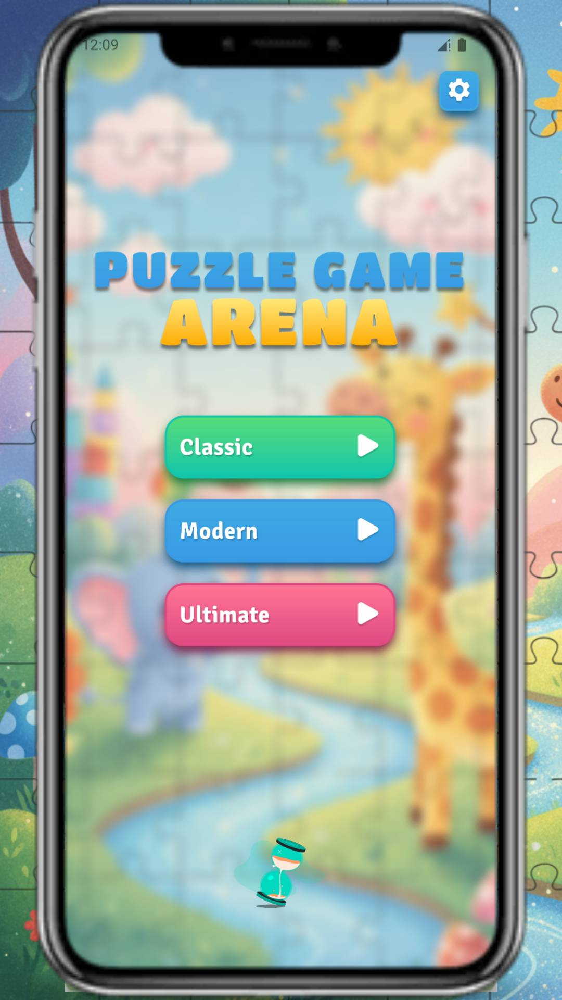
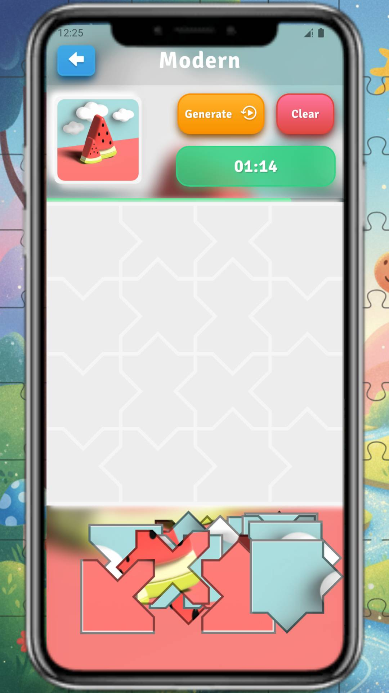

# 🧩 Puzzle Jigsaw Game

A fun and interactive **Puzzle Jigsaw Game** built with **Flutter**, where players can drag and drop pieces to complete the picture.  
Supports multiple levels of difficulty, smooth animations, background music, and engaging sound effects.

---

## 📱 Features

- 🧠 **Classic & Modern Modes** — two gameplay styles for different experiences  
- 🖼️ **Dynamic Puzzle Generator** — splits images into pieces based on selected level  
- 🎵 **Background Music & Sound Effects** — immersive gameplay experience  
- 🎨 **Beautiful UI** — clean design with smooth transitions  
- 💾 **Local Save System** — continue puzzles anytime  
- 🌍 **Multi-language Support** — English & Bahasa Indonesia  
- 📊 **Leaderboard (optional)** — show top players and scores *(if connected to backend)*

---

## 🚀 Getting Started

### 1️⃣ Clone Repository
```bash
git clone https://github.com/fanfantasi/puzzle_jigsaw.git
cd puzzle_jigsaw
```

### 2️⃣ Install Dependencies
```bash
flutter pub get
```

### 3️⃣ Run the App
```bash
flutter run
```

> 💡 Works on Android, iOS, macOS, and Web (Flutter 3.22+ recommended)

---

## 🧰 Tech Stack

| Category | Tools |
|-----------|--------|
| Framework | [Flutter](https://flutter.dev/) |
| Language | Dart |
| State Management | Provider / Riverpod *(depending on implementation)* |
| Audio | `audioplayers` |
| Ads | Google AdMob |
| Build Tools | Flutter SDK, Android Studio / VSCode |

---

## 🖼️ Screenshots

| Menu | Gameplay |
|-----------|------------|
|  |  |

*(Add your own screenshots in `/screenshot` folder)*

---

## ⚙️ Configuration

- To enable **Google AdMob**, edit your `android/app/src/main/AndroidManifest.xml` and insert your AdMob App ID.
- Audio files are located in `/assets/audio/`
- Puzzle images are stored in `/assets/images/`

---

## 🧑‍💻 Development

### Folder Structure
```
lib/
├── main.dart
├── models/
├── services/
│   ├── audio_service.dart
│   ├── music_service.dart
├── ui/
│   ├── screens/
│   ├── widgets/
└── utils/
```

---

## 🌐 Multi-Language Support

| Language | Code |
|-----------|------|
| English | `en` |
| Indonesian | `id` |

App language is automatically detected from device locale.

---

## 📄 License

This project is licensed under the **MIT License**.  
See the [LICENSE](LICENSE) file for details.

---

## 💬 Credits

Created with ❤️ by [fanfantasi](https://github.com/fanfantasi)

---

> “Every piece has its place — just like every line of code.” 🧩
